# gpc-aoosicate-cloud-engineer
This is the tutorial from GCP associate cloud engineering


# linux command

```bash
# 1. checking all running apps in linux
# https://www.2daygeek.com/how-to-check-all-running-services-in-linux/
$ service --status-all

# 2. start apache2
$ apt update
$ apt install apache2
$ service apache2 stop
$ service apache2 start


```

<br><br><br><br><br><br><br><br>

# Intro
1. materials [link](https://www.in28minutes.com/resources-google-cloud-ace)

2. without cloud
    - high cost of procuring infrastructure
    - Needs ahead of time planning
    - low infrasturcture utilization (peak load provisioning)
    - dedicated infrastructure maintenance team

3. why cloud?
    - how about provisioning (renting) resources when you want them and releasing them back when you do not need them
        - on-demand resource provisioning
        - aka. `Elasticity`
4. advantage of cloud
    - trade `capital expense` for `variable expense`
    - benefit from massive economies of scale
    - stop guessing capacity
    - stop spending money runnign and maintaining data centers
    - `go global` in mins

5. learning path
    

<br><br><br><br><br><br><br><br>

# 2. Google Cloud Regions and Zones

## 2.1 why we meed regions and zones?

### deploy 1 DC in london
1. challenge-1: slow access for users from other parts of the world (`high latency`)
2. challenge-2: what if the data center crashes?
    - what if you application goes down (`low availability`)

### deploy 2 DC in london (Add one more data center)
1. challenge-1: still there
2. challenge-2: **SOLVED** 
2. challenge-3: what if entire region of London is unavailable
    - you app goes down

### Multiple regions (one more in Mumbai)
1. chall-1: **partly solved**
    - deploy your app in other regions
2. chall-2: **solved**
    - app still live from other dc
3. chall-3: **solved**
    - served from mumbai

 
 ## 2.2 understand regions and zones of GCP

 ### Regions
 1. Google provides 20+ regions around the world
 2. advantages:
    - high availability
    - low latency
    - global footprint
    - adhere to government `regulations`


### Zones
1. each region has 3+ zones at least
2. **increased availability and fault tolerance** within same region
3. each zone has 1 or more discrete clusters
    - cluster: distinct physical infrastructure that is housed in a data center
4. Zones in region are connected through **low-latency** links

5. regions and zones example
    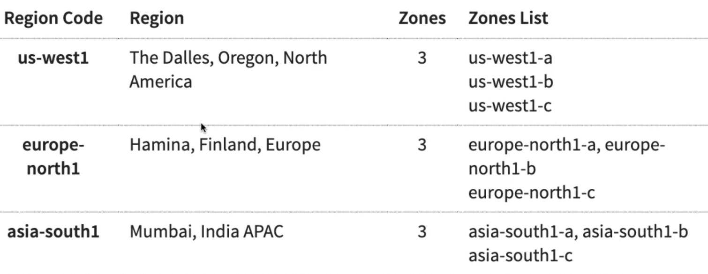
    


<br><br><br><br><br><br><br><br>

# 3. Google Compute Engine for Associate Cloud Engineer

## 3.1 Google Compute engine fundamentals (GCE)
1. create and manage lifecycle of virtual machine(VM) instances
2. `load balancing` and `auto scaling` for multiple VM instances
3. `attach storage` to your VM instance
4. manage `network connectivity and configuration` for your VM instances
5. Goal
    - setup VM instances as HTTP server
    - distribute load with load balancers
- 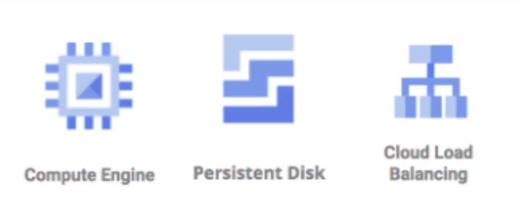


## 3.2 hands-on

1. New VM instance
2. understand differnt types and images in GCE
    - Genearl Purpose (E2, N2, N2D, N1): best price-performance ratio
        - web and application servers, small-medium databases, dev environments
    - Memory Optimized(M2, M1): ultra high memory workloads
        - large in-memory databases and in-memory analytics
    - compute optimized (C2): compute intensive workloads
        - gaming applications
3. `e2-standard-2`
    - e2 - machine type family
    - standard - type of workload
    - 2 - # of CPUs

4. installing http webserver on gcp vm
```bash
$ whoami
$ pwd
$ ls
$ sudo su

# to update
$ apt update

# install apache2
$ apt install apache2

# go to the ip
>> 10.176.12.23
```
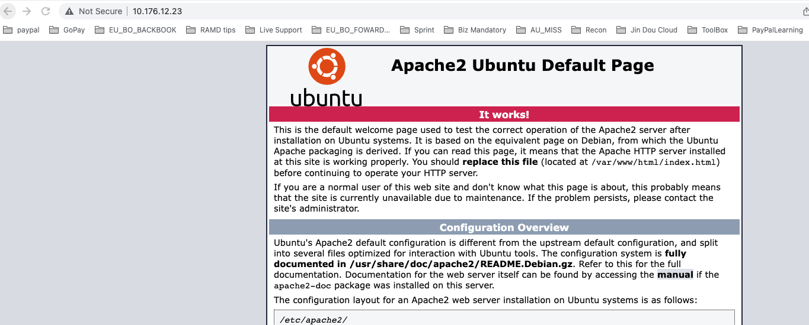


```bash
$ cd /var/www/html

$ echo "Hello world from $(hostname) $(hostname -u)" >> /var/www/html/index.html
```

5. Internal and External IP address
- External(public) IP addresses are Internet addressable
- Internal(private) IP addresses are internet to a corporate network
```bash
# stop apache2 service
$ service apache2 stop

# start apache2 service
$ service apache2 start
```

6. static ip
- use static ip address

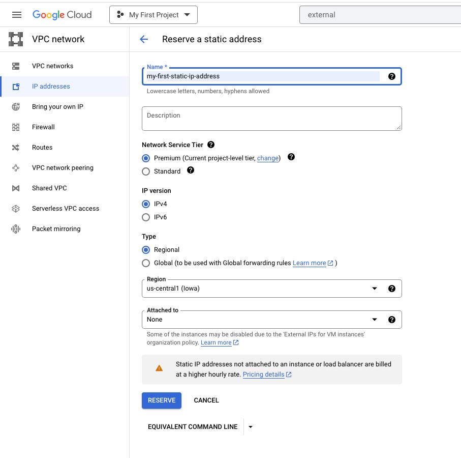


- static ip can be switched to another VM instance in same project


## 3.3 simplify web server setup

1. simplify
- `bootstarpping`: install OS patches or software when an VM instance is launched
- configure a startup script
```bash
# use -y it will not ask question

#!/bin/bash
apt update
apt -y install apache2
echo "hello world from $(hostname) $(hostname -I)" >> /var/www/html/index.html
```

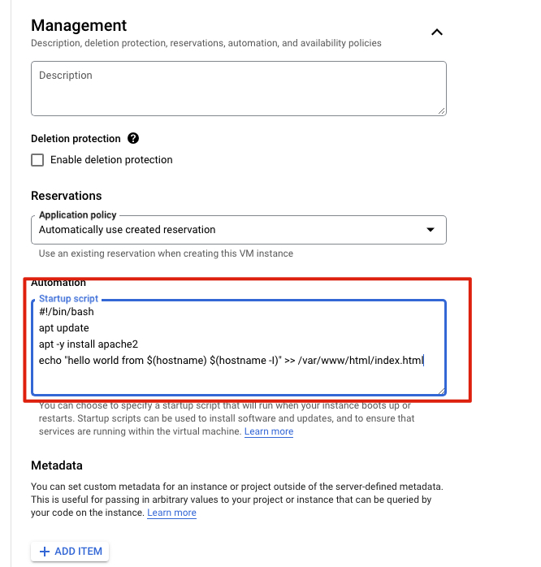


2. creation with instance template
- instance templates
    - define machine type, image, labels, startup script
    - provides a convenient way to create similar instances
    - image family can be specified

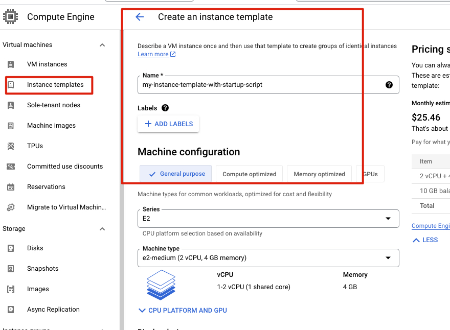


- create from template
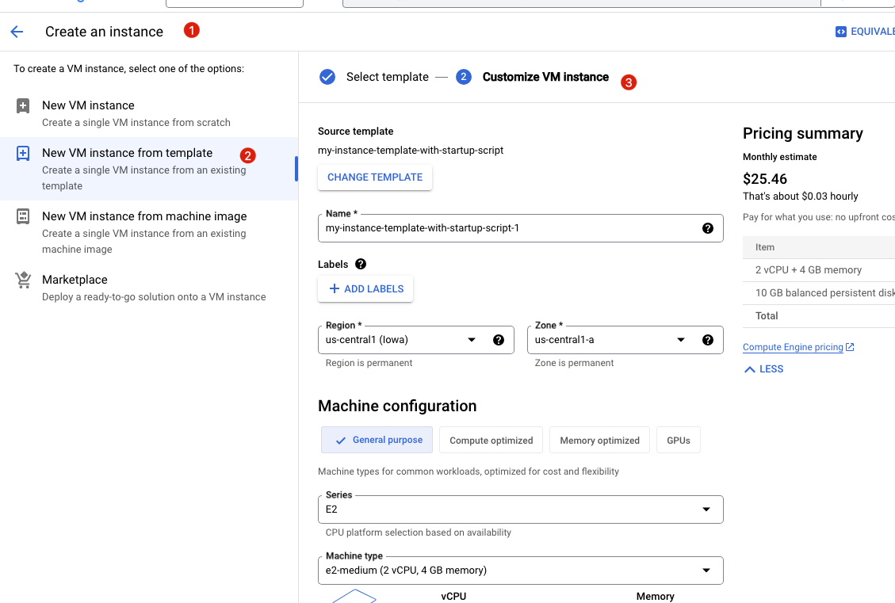


<br><br><br>

3. Reducing launch time with custom image
- installing OS patches and software at launch of VM instances increases boot up time
- creating a custom image with OS patches and software pre-installed
     - can be created from an instance, a persistent disk, a snapshot, another image or a file in Cloud storage
     - can be shared across projects
     - Deprecate old images
     - Hardening an image - customize images to your corporate security standards


stop instance while create an image
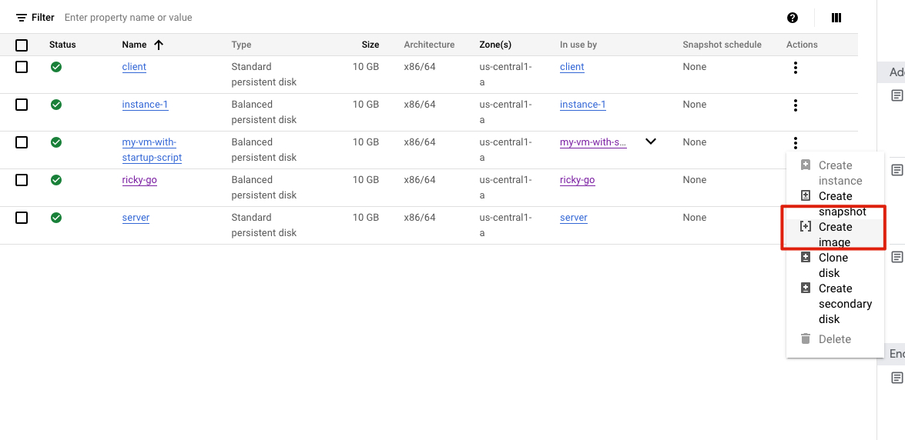

created custom image
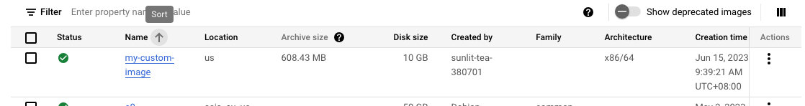


copy from `instance templates` and select our custom image
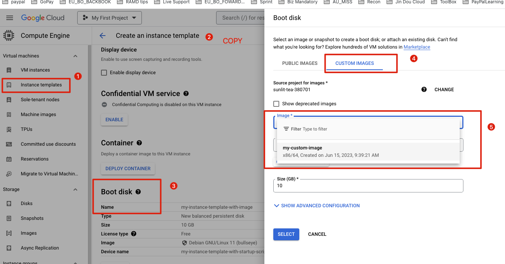


and we dont need install apache2 any more as image already contains that. we need start it
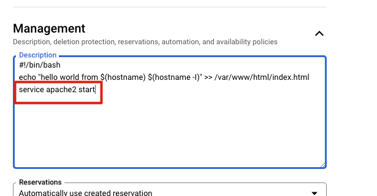

<br><br><br>

4. troubleshooting apache


