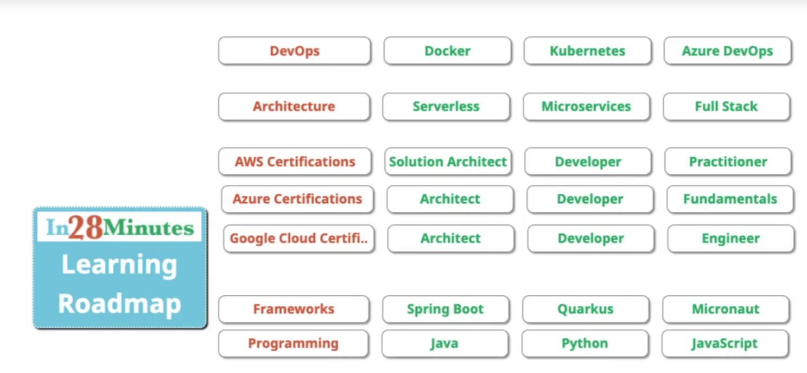
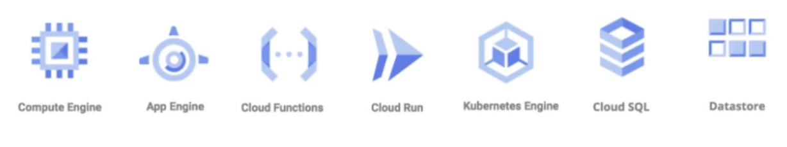

# gpc-aoosicate-cloud-engineer
This is the tutorial from GCP associate cloud engineering

        

# Intro
1. materials [link](https://www.in28minutes.com/resources-google-cloud-ace)

2. without cloud
    - high cost of procuring infrastructure
    - Needs ahead of time planning
    - low infrasturcture utilization (peak load provisioning)
    - dedicated infrastructure maintenance team

3. why cloud?
    - how about provisioning (renting) resources when you want them and releasing them back when you do not need them
        - on-demand resource provisioning
        - aka. `Elasticity`
4. advantage of cloud
    - trade `capital expense` for `variable expense`
    - benefit from massive economies of scale
    - stop guessing capacity
    - stop spending money runnign and maintaining data centers
    - `go global` in mins

5. learning path
    