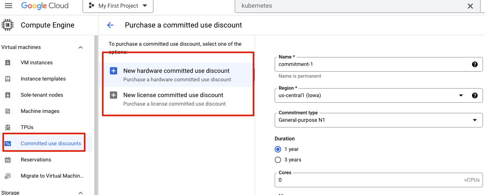

# gpc-aoosicate-cloud-engineer
This is the tutorial from GCP associate cloud engineering

https://pplearn.udemy.com/course/google-cloud-certification-associate-cloud-engineer/learn/lecture/25121396#content


# linux command

```bash
# 1. checking all running apps in linux
# https://www.2daygeek.com/how-to-check-all-running-services-in-linux/
$ service --status-all

# 2. start apache2
$ apt update
$ apt install apache2
$ service apache2 stop
$ service apache2 start


```

<br><br><br><br><br><br><br><br>

# Intro
1. materials [link](https://www.in28minutes.com/resources-google-cloud-ace)

2. without cloud
    - high cost of procuring infrastructure
    - Needs ahead of time planning
    - low infrasturcture utilization (peak load provisioning)
    - dedicated infrastructure maintenance team

3. why cloud?
    - how about provisioning (renting) resources when you want them and releasing them back when you do not need them
        - on-demand resource provisioning
        - aka. `Elasticity`
4. advantage of cloud
    - trade `capital expense` for `variable expense`
    - benefit from massive economies of scale
    - stop guessing capacity
    - stop spending money runnign and maintaining data centers
    - `go global` in mins

5. learning path
    

<br><br><br><br><br><br><br><br>

# 2. Google Cloud Regions and Zones

## 2.1 why we meed regions and zones?

### deploy 1 DC in london
1. challenge-1: slow access for users from other parts of the world (`high latency`)
2. challenge-2: what if the data center crashes?
    - what if you application goes down (`low availability`)

### deploy 2 DC in london (Add one more data center)
1. challenge-1: still there
2. challenge-2: **SOLVED** 
2. challenge-3: what if entire region of London is unavailable
    - you app goes down

### Multiple regions (one more in Mumbai)
1. chall-1: **partly solved**
    - deploy your app in other regions
2. chall-2: **solved**
    - app still live from other dc
3. chall-3: **solved**
    - served from mumbai

 
 ## 2.2 understand regions and zones of GCP

 ### Regions
 1. Google provides 20+ regions around the world
 2. advantages:
    - high availability
    - low latency
    - global footprint
    - adhere to government `regulations`


### Zones
1. each region has 3+ zones at least
2. **increased availability and fault tolerance** within same region
3. each zone has 1 or more discrete clusters
    - cluster: distinct physical infrastructure that is housed in a data center
4. Zones in region are connected through **low-latency** links

5. regions and zones example
    
    


<br><br><br><br><br><br><br><br>

# 3. Google Compute Engine for Associate Cloud Engineer

## 3.1 Google Compute engine fundamentals (GCE)
1. create and manage lifecycle of virtual machine(VM) instances
2. `load balancing` and `auto scaling` for multiple VM instances
3. `attach storage` to your VM instance
4. manage `network connectivity and configuration` for your VM instances
5. Goal
    - setup VM instances as HTTP server
    - distribute load with load balancers
- 


## 3.2 hands-on

1. New VM instance
2. understand differnt types and images in GCE
    - Genearl Purpose (E2, N2, N2D, N1): best price-performance ratio
        - web and application servers, small-medium databases, dev environments
    - Memory Optimized(M2, M1): ultra high memory workloads
        - large in-memory databases and in-memory analytics
    - compute optimized (C2): compute intensive workloads
        - gaming applications
3. `e2-standard-2`
    - e2 - machine type family
    - standard - type of workload
    - 2 - # of CPUs

4. installing http webserver on gcp vm
```bash
$ whoami
$ pwd
$ ls
$ sudo su

# to update
$ apt update

# install apache2
$ apt install apache2

# go to the ip
>> 10.176.12.23
```


```bash
$ cd /var/www/html

$ echo "Hello world from $(hostname) $(hostname -u)" >> /var/www/html/index.html
```

5. Internal and External IP address
- External(public) IP addresses are Internet addressable
- Internal(private) IP addresses are internet to a corporate network
```bash
# stop apache2 service
$ service apache2 stop

# start apache2 service
$ service apache2 start
```

6. static ip
- use static ip address


- static ip can be switched to another VM instance in same project


## 3.3 simplify web server setup

1. simplify
- `bootstarpping`: install OS patches or software when an VM instance is launched
- configure a startup script
```bash
# use -y it will not ask question

#!/bin/bash
apt update
apt -y install apache2
echo "hello world from $(hostname) $(hostname -I)" >> /var/www/html/index.html
```


2. creation with instance template
- instance templates
    - define machine type, image, labels, startup script
    - provides a convenient way to create similar instances
    - image family can be specified


- create from template


<br><br><br>

3. Reducing launch time with custom image
- installing OS patches and software at launch of VM instances increases boot up time
- creating a custom image with OS patches and software pre-installed
     - can be created from an instance, a persistent disk, a snapshot, another image or a file in Cloud storage
     - can be shared across projects
     - Deprecate old images
     - Hardening an image - customize images to your corporate security standards


stop instance while create an image


created custom image


copy from `instance templates` and select our custom image


and we dont need install apache2 any more as image already contains that. we need start it


<br><br><br>

4. troubleshooting apache


<br><br><br><br><br><br><br><br>

# 4. Google compute - optimizing costs and performance in GCP

## 4.1 save cost
1. sustained use discounts
    - applicable for instances by GKE and GCE
2. committed use discounts
    - commit for 1 year or 3 years
    - up to 70% discount
    - 
    

3. saving costs with preemptible VMS
    - short-lived cheaper (up to 80%) compute instance
        - can be stopped by GCP any time within 24 hrs
        - instances get 30s warning
    - use preempty VM's if 
        - you app are fault tolerant
        - cost sensitive
        - Not immediate 
    - looks no more preemptible VMs
        - 
        

4. spot VMs
    - latest version of preempitble VMS
    - doesn't have maxinum runtime

5. Billing
    - billed by the second
    - not billed for compute when a compute instance is stopped
        - will be billed for any storage attached with it
    - create budget to avoid amount
    - 
    

6. Live migration & availability policy
    - keep VM running when a host system needs to be updated
    - `Live migration`
        - running instance is migrated to another host in the same zone
    - important configuration
        - on host maintenance
            - Migrate: migrate VM instance to other hardware
            - terminate: stop the VM intance 
        - automatic restart
    - 
    

7. custom machine type

    - 
    

8. Compute Engine Features: GPUs
    - accelerate math intensive and graphics-intensive workloads for AI/ML 
    - add `GPU`
        - high performance
        - high cost
        - use images with GPU libraries (otherwise, GPU will not be used)
        - GPU restrictions
            - not supported all machine types
            - on host maintenance can only have the value 'terminate VM instance'
    - General purpose
        - N1 + add GPU
    - GPUs

9. VM in GCP
    - VM associated with a project
    - can only change machine type after stop the instance
    - filter
        - 
        
    - Auto monitoring
        - Default: CPU, network bytes, disk throughput/ IOPS
        - Cloud monitoring agent: memory utilization & disk space utilization

10. Best practices
    - chose zone and region based on
        - cost, regulations availability needs, latency and specific hardware needs
        - distribute instances in multiple zones
    - choose right machine type
    - reserve for `committed use discounts` for constant workloads
    - use preemptible instances for fault-tolerant
    - use labels to indicate environment, team, business unit etc

11. scenarios
    - pre-requisites to be able to create a VM 
        - project
        - billing acct
        - compute engines API
    - dedicated hardware for your compliance, licensing and management needs
        - sole-tenant nodes
        - 

    - 1000s of VM to automate OS patch management, OS inventory management and OS configuration management
        - VM manager
        - 
        

    - login to VM intance to install software
        - ssh to the instance

    - dont expose VM to internet
        - dont assign external IP address
    - want to allow HTTP traffic to your VM
        - configure firewall rules


<br><br><br><br><br><br><br><br>

# 5. Gcloud for associate Cloud engineer


<br><br><br>

## 5.1 Gcloud
1. command line interface to interact with google cloud resources
2. most GCP services supported
3. u can CRUD existing resources and perform actions like deployment
4. some GCP have specific CLI tools
    - Cloud storage - gsutil
    - Cloud BigQuery - bq
    - Cloud Bigtable - cbt
    - Kubernetes - kubectl
```bash
$ gcloud --version
```
- 


```bash
$ gcloud init
```

<br><br><br>

## 5.2 gcloud config set

```bash
$ gcloud config list

$ gcloud config list account
>>account = patchapiuser@pp-devcos-cyan.iam.gserviceaccount.com

$ gcloud config list compute/region

# change default region or zone
$ gcloud config set core/project VALUE
$ gcloud config set compute/region VALUE
$ gcloud config set compute/zone VALUE
$ gcloud config set core/verbosity VALUE(debug)

# Syntax - gcloud config set SECTION/PROPERTY VALUE
- core, compute - SECTIONS
- project, region, zone - PROPERTIES
- specifying core is optional as it is default SECTION!
    - gcloud config set project VALUE
    - gcloud config set verbosity VALUE(debug)
- get more details with 
$ gcloud config set --help
$ gcloud config list --help

# list all set or unset properties
$ gcloud config list --all

# opposite - gcloud config unset
```

<br><br><br>

## 5.3 managing multiple configs

```bash

$ gcloud config configurations list

# create multiple configurations
$ gcloud config configurations create my-second-configuration
# set property
$ gcloud config set project pp-devcos-cyan
$ gcloud config list


$ gcloud config configurations list

# activate default configuration
$ gcloud config configurations activate default

# describe a configuration
$ gcloud config configurations describe my-second-configuration

```

<br><br><br>

## 5.4 gcloud command structure - playing with services
- gcloud GROUP SUBGROUP ACTION ...
    - GROUP - config or compute or container or dataflow or functions or iam or ...
        - which service group are u playing with?
    - SUBGROUP - instances or images or instance-templates or machine-types or regions or zones
        - which sub group of the services do u want to play with?
    - ACTION - create or list or start or stop or describe or ...
        - what do u want to do?

```bash
# create instance
$ gcloud compute instances create my-first-instance-from-gcloud

# list all compute instances
$ gcloud compute instances list

# delete instance
$ gcloud compute instances delete my-first-instance-from-gcloud


$ gcloud compute zones list
$ gcloud compute regions list
$ gcloud compute machine-types list
$ gcloud compute machine-types list --filter zone:us-central1-b
$ gcloud compute machine-types list --filter "zone:(us-central1-b us-central1-a us-central1-c)"

```

<br><br><br>

## 5.5 playing with gcloud compute instances create
https://cloud.google.com/sdk/gcloud/reference/compute/instances/create
- Crating compute instances
    - gcloud compute instances create [NAME]
        - Options
            - --machine-type (default type is n1-standard-1 -gcloud compute machine-types list)
            - --custome-cpus --custom-memory --custom-vm-type(n1/n2) (custome machine)
                - custom-cpu 6 --custom-memory 3072MB --custom-vm-type n2
            - --image or --image-family or --source-snapshot or - --source-instance-tempalte or --source-machine-image(beta)
            - --service-account or --no-service-account
            - --zone=us-central1-b
            - --tags
            - --preemptible
            - --restart-on-failure(default) --no-restart-on-failure --maintenance-policy(MIGRATE(default)/ TERMINATE)
            - --boot-disk-size, --boot-disk-type --boot-disk-auto-delete(default), --no-boot-disk-auto-delete
            - --deletion-protection --no-deletion-protection(default)
            - --metadata/metadata-from-file startup-script/startup-script-url
                - --matadata-from-file startup-script=/local/path/to/script/startup OR --metadata startup-script="echo 'hello world'"
                - shutdown-script
            - --network --subnet --network-tier (PREMIUM(default), STANDARD)
            - --accelerator="type=nvidia-tesla-v100,count=8" --metadata="install-nvidia-driver=True" (GPU)


<br><br><br>

## 5.6 setting default region and zone for compute engine
- Three options
    - option 1 (centralized configuration): gcloud compute project-info add-metadata
        - --metadata=[google-compute-default-region=REGION|google-compute-default-zone=ZONE]
        -  
    - option 2 (Local glcoud configuration): gcloud config set compute/region REGION
    - option 3 (command specific): --zone or --region in the command
- Priority: Option 3 (if exists) overrides Option 2 (if exists) overrides Option 1


<br><br><br>

## 5.7 exploring gcloud command - list and describe
- Typically list commands are used to list a set of resources 
    - gcloud compute RESOURCES list
        - gcloud compute images/regions/zones/disk-types list
        - gcloud compute instances/disks/snapshots list
        
    - most list commands support a few common options
        - --filter="zone:VALUE"
            - gcloud compute zones list --filter=region:us-west2
        - --sort-by (NAME, ~NAME)
            - gcloud compute zones list --sort-by=region
            - gcloud compute zones list --sort-by=~region (in reverse order)
        - --uri
            - gcloud compute zones list --uri
            - gcloud compute regions list --uri
        - gcloud compute imgages list --sort-by NAME --filter "PROJECT:(window-cloud ubuntu-os-cloud)"
- Typically describe commands are used to describe a specific resource
    - gcloud compute images describe ubuntu-1604-xenial-v20210203 --project ubuntu-os-cloud
    - gcloud compute regions describe us-central1

<br><br><br>

## 5.8 playing with compute instances - gcloud
- playing with compute instances
    - gcloud compute instances list/start/stop/delete/reset/describe/move
        - gcloud compute instances start example-instance
        - gcloud compute instances stop example-instance-1 example-instance-2
        - gcloud compute instances delete example-instance
            - --delete-disks=VALUE(all or data or boot)
            - --keep-disks=VALUE(all or data or boot)
        - gcloud compute instances move example-instance-1 --zone use-central1-b --destination-zone us-central1-f
            - move a VM from one zone to another

<br><br><br>

## 5.9 playing with instance template in gcloud
- gcloud compute instance-templates create/delete/describe/list 
    - gcloud compute intance-templates create INSTANCE-TEMPLATE
        - script
        ```bash
        - gcloud compute instance-templates list
        - gcloud compute instance-templates create instance-template-from-command-line
        - gcloud compute instance-templates delete instance-template-from-command-line
        ```
        - --source-instance=SOURCE_INSTANCE --source-instance-zone (which instance to create a template from?)
        - supports almost all options supported by `gcloud compute instances create [NAME]`
            - --image or --image-family or --source-snapshot or --source-instance-template
            - --service-account or --no-service-account
            - --tags
            - --preemptible
            - --restart-on-failure(default) --no-restart-on-failure --maintenance-policy(MIGRATE(default)/ TERMINATE)
            - --boot-disk-size, --boot-disk-type --boot-disk-auto-delete(default), --no-boot-disk-auto-delete
            - --deletion-protection --no-deletion-protection(default)
            - --metadata/metadata-from-file startup-script/startup-script-url
            - --network --subnet --network-tier (PREMIUM(default), STANDARD)
            - --accelerator="type=nvidia-tesla-v100,count=8" --metadata="install-nvidia-driver=True" (GPU)
    - Other examples:
        - gcloud compute intance-templates delete INSTANCE-TEMPLATE

        ```bash
        $ gcloud compute instances create my-test-vm --source-instance-template=my-instance-template-with-custom-image
        ```